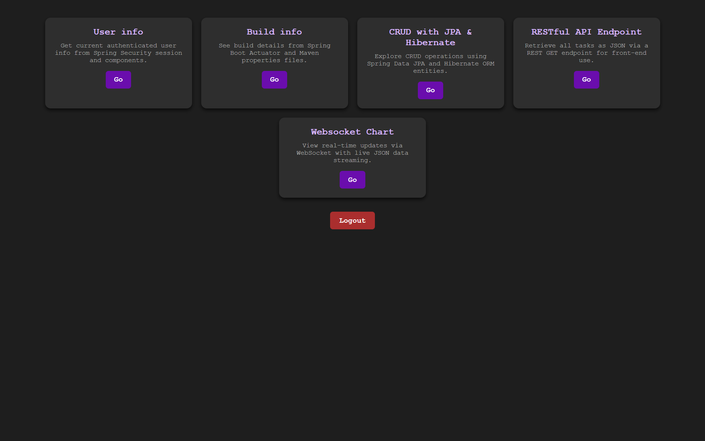
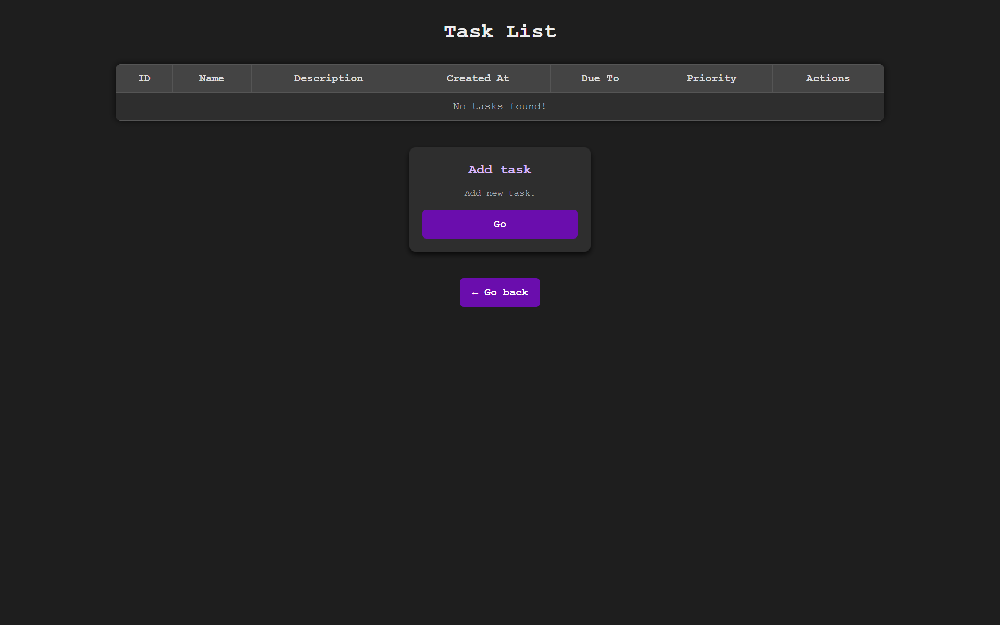

# Spring MVC Showcase

This is a full-featured demo application built to demonstrate core Java Spring skills, including MVC architecture, REST APIs, Spring Security, WebSocket communication, and JSP/Thymeleaf-based UI.

> Designed as a complete backend showcase for recruiters and employers.

## Features Implemented

- MVC Architecture (Controllers, Services, Views, Models)
- JSP/Thymeleaf templating with formatting, tables, and Spring Security integration
- Session management (e.g., storing logged-in user state)
- Custom database schema with ORM (CRUD operations via JPA)
- Secure user login, roles, and permissions (Spring Security)
- RESTful API serving JSON (mock & DB-based data)
- WebSocket support (real-time data updates via JS client)
- HTTPS with self-signed certificate (SSL/TLS)
- Actuator integration for environment and project metadata

## Tech Stack

- Java 17
- Spring Boot
- Spring MVC
- Spring Security
- Spring Data JPA (Hibernate)
- MySQL
- Thymeleaf / JSP
- WebSocket
- Maven

## Important: Database Setup

This application uses **MySQL** as its primary database.

To run the app successfully, you **must have a running MySQL server** with credentials and connection details matching those in `src/main/resources/application.properties`.

Make sure to:

- Start your MySQL server before running the app
- Create the required database/schema manually or use the included schema export (see below)
- Adjust username/password/URL in `application.properties` as needed

---

## Running with External Apache Tomcat 9.0.46

This project was deployed on an external Apache Tomcat 9.0.46 server.

### Setup instructions:

- Install Apache Tomcat 9.0.46 (if not already installed).
- Configure HTTPS by setting up the self-signed SSL/TLS certificate in Tomcat's `server.xml`.
- Deploy the WAR file generated by Maven into the `webapps` directory of Tomcat.
- Make sure the MySQL server is running and accessible as configured in `application.properties`.
- Start Tomcat server and access the app at `https://localhost:8443`.

> Note: The SSL certificate configuration is required to enable HTTPS support, which is essential for secure login and WebSocket connections.

## Screenshots

## How to Run

### Running the Project on Apache Tomcat via NetBeans

1. Open the project in NetBeans.
2. Configure Apache Tomcat 9.0.46 server in NetBeans (if not already set up).
3. Make sure your MySQL server is running and configured correctly as per `application.properties`.
4. Right-click the project in NetBeans and select **Run** or **Deploy**. NetBeans will build the WAR file and deploy it to the configured Tomcat server automatically.
5. Open your browser and navigate to `https://localhost:8443/<context-path>`, where `<context-path>` is usually the project name or WAR file name.

> Note: Ensure your Tomcat is configured with the proper SSL certificate to enable HTTPS.

> Default user: `admin` / password: `admin` | user: `user` / password: `user` (adjust in mysql db)

---

**⭐ If you're a recruiter, feel free to explore the code or reach out!**
